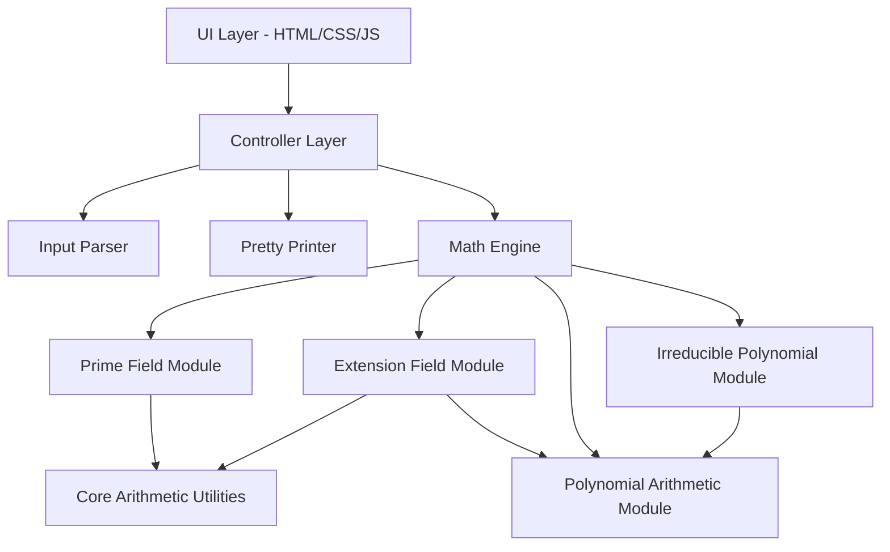
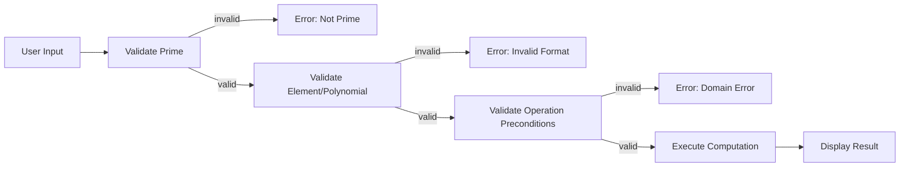

# Design Document: Finite Field Calculator

## Overview

The Finite Field Calculator is a client-side web application that performs arithmetic operations within finite fields (Galois fields). It supports both prime fields GF(p) and extension fields GF(p^n), providing addition, subtraction, multiplication, division, exponentiation, inverse computation, polynomial arithmetic, and irreducible polynomial assistance.

The application is built as a single-page application (SPA) with no backend dependencies, deployed to GitHub Pages via GitHub Actions. The core math engine is implemented in TypeScript for type safety and testability, with a clean separation between computation logic and UI rendering.

### Key Design Decisions

1. **TypeScript** — Type safety for polynomial and field element representations, good tooling ecosystem, compiles to JavaScript for browser execution.
2. **Pure computation layer** — All field arithmetic is implemented as pure functions, making them independently testable with property-based tests.
3. **Polynomial representation** — Extension field elements are stored as coefficient arrays (index = degree), normalized to remove trailing zeros.
4. **BigInt for prime field elements** — Supports arbitrarily large primes without overflow concerns.
5. **Vite build tooling** — Fast builds, native TypeScript support, simple GitHub Pages deployment.
6. **No external math libraries** — Custom implementation of finite field arithmetic to keep bundle size small and avoid heavy dependencies.

## Architecture

The application follows a layered architecture separating concerns into computation, parsing/formatting, and presentation layers.



### Layer Responsibilities

| Layer | Responsibility |
|-------|---------------|
| UI Layer | HTML forms, result display, error messages, field configuration controls |
| Controller Layer | Orchestrates user actions, validates field configuration, dispatches operations |
| Input Parser | Converts string input to internal representations (integers or polynomial coefficients) |
| Pretty Printer | Converts internal representations to human-readable formatted strings |
| Math Engine | Stateless arithmetic operations on field elements and polynomials |

## Components and Interfaces

### Core Arithmetic Utilities

```typescript
// core/mod-arithmetic.ts
function modAdd(a: bigint, b: bigint, p: bigint): bigint;
function modSub(a: bigint, b: bigint, p: bigint): bigint;
function modMul(a: bigint, b: bigint, p: bigint): bigint;
function modPow(base: bigint, exp: bigint, p: bigint): bigint;
function modInverse(a: bigint, p: bigint): bigint; // Extended Euclidean Algorithm
function isPrime(n: bigint): boolean; // Miller-Rabin primality test
```

### Prime Field Module

```typescript
// fields/prime-field.ts
interface PrimeFieldConfig {
  p: bigint;
}

function primeFieldAdd(a: bigint, b: bigint, config: PrimeFieldConfig): bigint;
function primeFieldSub(a: bigint, b: bigint, config: PrimeFieldConfig): bigint;
function primeFieldMul(a: bigint, b: bigint, config: PrimeFieldConfig): bigint;
function primeFieldInverse(a: bigint, config: PrimeFieldConfig): bigint;
function primeFieldDiv(a: bigint, b: bigint, config: PrimeFieldConfig): bigint;
function primeFieldPow(a: bigint, k: bigint, config: PrimeFieldConfig): bigint;
```

### Extension Field Module

```typescript
// fields/extension-field.ts
type Polynomial = bigint[]; // coefficients[i] = coefficient of x^i

interface ExtFieldConfig {
  p: bigint;
  n: number;
  irreducible: Polynomial; // irreducible polynomial of degree n
}

function extFieldAdd(a: Polynomial, b: Polynomial, config: ExtFieldConfig): Polynomial;
function extFieldSub(a: Polynomial, b: Polynomial, config: ExtFieldConfig): Polynomial;
function extFieldMul(a: Polynomial, b: Polynomial, config: ExtFieldConfig): Polynomial;
function extFieldInverse(a: Polynomial, config: ExtFieldConfig): Polynomial;
function extFieldDiv(a: Polynomial, b: Polynomial, config: ExtFieldConfig): Polynomial;
function extFieldPow(a: Polynomial, k: bigint, config: ExtFieldConfig): Polynomial;
```

### Polynomial Arithmetic Module

```typescript
// poly/polynomial.ts
function polyAdd(a: Polynomial, b: Polynomial, p: bigint): Polynomial;
function polySub(a: Polynomial, b: Polynomial, p: bigint): Polynomial;
function polyMul(a: Polynomial, b: Polynomial, p: bigint): Polynomial;
function polyDivMod(a: Polynomial, b: Polynomial, p: bigint): { quotient: Polynomial; remainder: Polynomial };
function polyReduce(a: Polynomial, modulus: Polynomial, p: bigint): Polynomial;
function polyEqual(a: Polynomial, b: Polynomial): boolean;
function polyIsZero(a: Polynomial): boolean;
function polyNormalize(a: Polynomial): Polynomial; // Remove trailing zero coefficients
```

### Irreducible Polynomial Module

```typescript
// poly/irreducible.ts
function isIrreducible(poly: Polynomial, p: bigint): boolean;
function findIrreducible(degree: number, p: bigint): Polynomial;
```

### Input Parser

```typescript
// parser/input-parser.ts
type ParseResult = 
  | { ok: true; value: bigint }        // Prime field element
  | { ok: true; value: Polynomial }    // Extension field element or polynomial
  | { ok: false; error: string };

function parseFieldElement(input: string, config: PrimeFieldConfig | ExtFieldConfig): ParseResult;
function parsePolynomial(input: string, p: bigint): ParseResult;
```

### Pretty Printer

```typescript
// formatter/pretty-printer.ts
function formatPrimeElement(value: bigint): string;
function formatPolynomial(poly: Polynomial, variable?: string): string;
function formatResult(operation: string, operands: string[], result: string): string;
```

### Controller

```typescript
// controller/calculator-controller.ts
type FieldConfig = 
  | { type: 'prime'; config: PrimeFieldConfig }
  | { type: 'extension'; config: ExtFieldConfig };

interface CalculatorState {
  fieldConfig: FieldConfig | null;
}

function configureField(params: { p: string; n?: string; irreducible?: string }): Result<FieldConfig, string>;
function executeOperation(op: Operation, operands: string[], state: CalculatorState): Result<string, string>;
```

## Data Models

### Field Element Representation

```typescript
// Prime field: elements are bigint values in [0, p-1]
type PrimeElement = bigint;

// Extension field: elements are polynomials of degree < n with coefficients in [0, p-1]
// Stored as coefficient arrays where index = degree
// Example: 2x^2 + 3x + 1 in GF(5^3) → [1n, 3n, 2n]
type ExtElement = Polynomial;
```

### Polynomial Representation

```typescript
// Coefficients stored in ascending degree order
// poly[i] is the coefficient of x^i
// Normalized: no trailing zeros (except the zero polynomial which is [])
type Polynomial = bigint[];

// The zero polynomial
const ZERO_POLY: Polynomial = [];
```

### Operation Types

```typescript
type Operation = 
  | 'add' | 'sub' | 'mul' | 'div' 
  | 'inverse' | 'pow'
  | 'poly_add' | 'poly_mul' | 'poly_div'
  | 'find_irreducible' | 'check_irreducible';
```

### Result Type

```typescript
type Result<T, E> = { ok: true; value: T } | { ok: false; error: E };
```


## Correctness Properties

*A property is a characteristic or behavior that should hold true across all valid executions of a system—essentially, a formal statement about what the system should do. Properties serve as the bridge between human-readable specifications and machine-verifiable correctness guarantees.*

### Property 1: Parse–Format Round Trip

*For any* valid field element (prime or extension), formatting the element with the Pretty Printer and then parsing the resulting string SHALL produce a field element equivalent to the original.

**Validates: Requirements 2.4**

### Property 2: Addition Commutativity

*For any* two field elements a and b in the same field (GF(p) or GF(p^n)), a + b SHALL equal b + a.

**Validates: Requirements 3.1, 3.2**

### Property 3: Additive Inverse (Subtraction)

*For any* field element a in a field, a - a SHALL equal the zero element (additive identity), and a + (0 - a) SHALL equal the zero element.

**Validates: Requirements 3.3, 3.4**

### Property 4: Multiplication Commutativity

*For any* two field elements a and b in the same field (GF(p) or GF(p^n)), a × b SHALL equal b × a.

**Validates: Requirements 4.1, 4.2**

### Property 5: Multiplicative Inverse

*For any* non-zero field element a in a field (GF(p) or GF(p^n)), a × inverse(a) SHALL equal the multiplicative identity (1).

**Validates: Requirements 5.1**

### Property 6: Division as Multiplication by Inverse

*For any* field element a and non-zero field element b in the same field, a / b SHALL equal a × inverse(b).

**Validates: Requirements 5.2**

### Property 7: Exponentiation Homomorphism

*For any* non-zero field element a and any two non-negative integers m and n, a^(m+n) SHALL equal a^m × a^n in the current field.

**Validates: Requirements 6.1, 6.2**

### Property 8: Polynomial Division Invariant

*For any* polynomial a and non-zero polynomial b over GF(p), if (q, r) = polyDivMod(a, b), then a SHALL equal b × q + r, and the degree of r SHALL be less than the degree of b.

**Validates: Requirements 7.3**

### Property 9: Polynomial Addition Commutativity

*For any* two polynomials a and b over GF(p), polyAdd(a, b) SHALL equal polyAdd(b, a), and all coefficients in the result SHALL be in the range [0, p-1].

**Validates: Requirements 7.1**

### Property 10: Polynomial Multiplication Coefficients in Range

*For any* two polynomials a and b over GF(p), all coefficients of polyMul(a, b) SHALL be in the range [0, p-1].

**Validates: Requirements 7.2**

### Property 11: Non-Prime Rejection

*For any* composite integer n > 1, the field configuration function SHALL reject n with an error indicating that the value must be prime.

**Validates: Requirements 1.3**

### Property 12: Irreducible Polynomial Generation

*For any* prime p and degree n ≥ 2, findIrreducible(n, p) SHALL return a polynomial of degree exactly n that passes the isIrreducible check.

**Validates: Requirements 11.1**

### Property 13: Irreducibility Check Correctness (Reducible Polynomials)

*For any* two non-constant polynomials f and g over GF(p), isIrreducible(f × g, p) SHALL return false.

**Validates: Requirements 1.4, 11.2**

### Property 14: Error Preservation of Field Configuration

*For any* valid field configuration and any operation that produces an error (invalid input, division by zero, etc.), the field configuration SHALL remain unchanged after the error.

**Validates: Requirements 9.3**

### Property 15: Formatting Produces Valid Range (Prime Field)

*For any* prime field element in GF(p), formatPrimeElement SHALL produce a string representing an integer in the range [0, p-1].

**Validates: Requirements 8.1**

## Error Handling

### Error Categories

| Category | Trigger | User Message |
|----------|---------|--------------|
| Invalid Prime | Non-prime p provided | "The value {p} is not a prime number. Please enter a prime." |
| Reducible Polynomial | Non-irreducible polynomial provided for extension field | "The polynomial {poly} is reducible over GF({p}). Please provide an irreducible polynomial of degree {n}." |
| Invalid Element Range | Value outside [0, p-1] or invalid polynomial coefficients | "Invalid element: coefficients must be in [0, {p-1}] and degree less than {n}." |
| Division by Zero | Division by zero element or zero polynomial | "Division by zero is undefined in any field." |
| Inverse of Zero | Inverse of zero element requested | "The zero element has no multiplicative inverse." |
| Zero to Negative Power | 0^k where k < 0 | "Exponentiation of zero to a negative power is undefined." |
| Parse Error | Malformed expression | "Could not parse input. Expected format: {format_description}" |
| Internal Error | Unexpected computation failure | "An unexpected error occurred. The calculator remains in a usable state." |

### Error Handling Strategy

1. **Validation-first approach**: All inputs are validated before computation begins. The parser returns a `Result` type, and validation functions return descriptive error messages.

2. **No exceptions for expected errors**: All expected error conditions (division by zero, invalid input) are handled through the `Result<T, E>` return type, not thrown exceptions.

3. **State preservation**: Errors never mutate the field configuration. The controller catches errors and returns them to the UI without modifying internal state.

4. **Error recovery**: After any error, the user can immediately retry with corrected input. No "reset" action is needed.

### Validation Pipeline



## Testing Strategy

### Testing Framework

- **Unit testing**: Vitest (fast, TypeScript-native, compatible with Vite build system)
- **Property-based testing**: fast-check (mature PBT library for TypeScript/JavaScript)
- **Coverage target**: 95%+ for computation modules, 80%+ overall

### Test Organization

```
tests/
├── unit/
│   ├── core/
│   │   └── mod-arithmetic.test.ts
│   ├── fields/
│   │   ├── prime-field.test.ts
│   │   └── extension-field.test.ts
│   ├── poly/
│   │   ├── polynomial.test.ts
│   │   └── irreducible.test.ts
│   ├── parser/
│   │   └── input-parser.test.ts
│   └── formatter/
│       └── pretty-printer.test.ts
├── property/
│   ├── field-arithmetic.property.test.ts
│   ├── polynomial-arithmetic.property.test.ts
│   ├── parse-format-roundtrip.property.test.ts
│   ├── inverse-and-division.property.test.ts
│   ├── exponentiation.property.test.ts
│   ├── irreducible.property.test.ts
│   └── validation.property.test.ts
└── integration/
    └── calculator-controller.test.ts
```

### Property-Based Testing Configuration

- **Library**: fast-check
- **Minimum iterations**: 100 per property test
- **Each property test references its design document property**
- **Tag format**: `Feature: finite-field-calculator, Property {N}: {title}`

### Generators (fast-check Arbitraries)

Key generators needed for property tests:

1. **Prime generator**: Generates random primes (small primes for speed: 2, 3, 5, 7, 11, 13, ...)
2. **Prime field element generator**: Given p, generates bigint in [0, p-1]
3. **Polynomial generator**: Given p and max degree, generates random polynomial with coefficients in [0, p-1]
4. **Extension field config generator**: Generates valid (p, n, irreducible) triples
5. **Extension field element generator**: Given config, generates valid polynomial of degree < n
6. **Composite number generator**: Generates non-prime integers > 1
7. **Reducible polynomial generator**: Generates product of two non-constant polynomials over GF(p)

### Unit Test Focus Areas

- **Edge cases**: Zero element operations, identity element, boundary primes (2, 3)
- **Specific examples**: Known correct results from textbooks (e.g., GF(2^8) used in AES)
- **Error conditions**: All error paths in the error handling table above
- **Parser**: Specific syntax cases (leading/trailing whitespace, superscripts, various notations)
- **Formatter**: Zero polynomial, constant polynomial, standard polynomial formatting

### Integration Tests

- Field configuration flow: configure → compute → reconfigure → verify state clear
- Full operation flow: configure field → parse input → compute → format output → display
- Error recovery flow: configure → trigger error → verify config preserved → retry succeeds

### CI/CD Testing

- All tests run in the GitHub Actions workflow before deployment
- Build fails on any test failure, preventing broken deployments
- Tests run with `vitest --run` (single execution, no watch mode)
