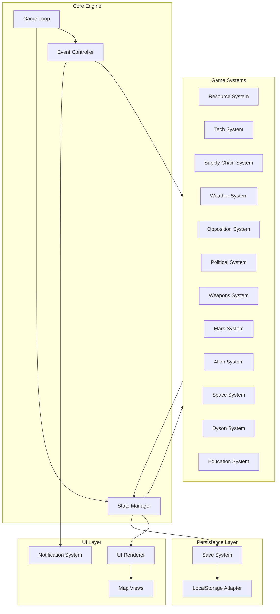

# Design Document: Sun Harvester Game

## Overview

Sun Harvester is a browser-based incremental management game built with TypeScript and Vite. Players progress through seven eras—from fossil fuels to constructing a Dyson Ring—by managing resources, supply chains, technology research, political influence, and military power. The game runs entirely client-side with state persisted to localStorage.

The architecture follows an **Entity-Component-System (ECS)-inspired** pattern adapted for incremental games: a central game loop ticks the simulation forward, discrete systems process their domains (resources, research, crafting, diplomacy), and the UI reactively renders state changes. This separation enables offline calculation, testable pure logic, and clean extensibility as new eras unlock.

### Key Design Decisions

1. **Tick-based simulation** — The game advances via discrete ticks (1/second active, bulk-calculated offline). All production, consumption, and events are deterministic functions of state + elapsed ticks.
2. **Modular system architecture** — Each game domain (resources, research, supply chain, opposition, etc.) is an independent system with a well-defined interface. Systems communicate through a shared game state object.
3. **Data-driven content** — Eras, recipes, tech trees, countries, and events are defined as static data (JSON/TS constants), not hardcoded logic. This makes balancing and content additions straightforward.
4. **Offline-first persistence** — All state lives in localStorage with JSON serialization. Export/import uses the same format. No server dependency.
5. **Progressive complexity** — Systems are unlocked per-era. Early game exposes only resources + coal plants; later eras add Mars, aliens, politics, etc.

## Architecture



### Game Loop

The game loop is the central orchestrator:

1. **Active mode**: `requestAnimationFrame` drives rendering; a 1-second interval triggers simulation ticks.
2. **Offline mode**: On load, calculates `elapsedSeconds = min(now - lastSave, 86400)` and runs a bulk tick computation.
3. Each tick calls `system.update(state, deltaTicks)` on all active systems in dependency order.

### System Dependency Order

```
1. Weather System (updates modifiers)
2. Resource System (production/consumption)
3. Supply Chain System (crafting automation)
4. Tech System (research progress)
5. Weapons System (production)
6. Political System (influence growth)
7. Opposition System (event checks)
8. Alien System (encounter rolls)
9. Space System (territory production)
10. Mars System (Mars production)
11. Dyson System (segment progress)
12. Education System (quiz scheduling)
```

## Components and Interfaces

### Core Interfaces

```typescript
interface GameSystem {
  id: string;
  /** Eras in which this system is active */
  activeEras: Era[];
  /** Process one or more ticks */
  update(state: GameState, deltaTicks: number): StateUpdate;
  /** Check if a specific action is valid */
  canPerform(state: GameState, action: GameAction): boolean;
  /** Execute a player action */
  perform(state: GameState, action: GameAction): StateUpdate;
}

interface StateUpdate {
  resources?: Partial<ResourceMap>;
  materials?: Partial<MaterialMap>;
  unlocks?: string[];
  events?: GameEvent[];
  mutations?: StateMutation[];
}

interface GameEvent {
  id: string;
  type: EventType;
  payload: Record<string, unknown>;
  timestamp: number;
}

type EventType =
  | 'era_unlock'
  | 'research_complete'
  | 'weather_change'
  | 'protest'
  | 'un_attack'
  | 'alien_signal'
  | 'alien_encounter'
  | 'crafting_complete'
  | 'dyson_segment_complete'
  | 'victory'
  | 'quiz'
  | 'coup'
  | 'politician_installed';
```

### Resource System Interface

```typescript
interface ResourceSystem extends GameSystem {
  calculateProduction(state: GameState): ProductionReport;
  calculateOfflineEarnings(state: GameState, elapsedSeconds: number): ResourceMap;
  applyWeatherModifier(base: number, weather: WeatherCondition): number;
}

interface ProductionReport {
  energyPerSecond: number;
  currencyPerSecond: number;
  maintenanceCostPerSecond: number;
  netCurrencyPerSecond: number;
  materialRates: Record<MaterialType, number>;
}
```

### Tech System Interface

```typescript
interface TechSystem extends GameSystem {
  getAvailableNodes(state: GameState, tree: TechTreeId): TechNode[];
  startResearch(state: GameState, nodeId: string): StateUpdate;
  getCrossSynergies(state: GameState, nodeId: string): SynergyBonus[];
}

type TechTreeId = 'energy' | 'materials' | 'weapons' | 'political' | 'space';

interface TechNode {
  id: string;
  tree: TechTreeId;
  name: string;
  description: string;
  educationalContent: string;
  tier: number;
  cost: { currency: number; knowledge: number };
  researchTime: number; // ticks
  prerequisites: string[];
  bonus: TechBonus;
  status: 'locked' | 'available' | 'researching' | 'completed';
}
```

### Supply Chain Interface

```typescript
interface SupplyChainSystem extends GameSystem {
  getRecipes(state: GameState): Recipe[];
  queueCraft(state: GameState, recipeId: string, quantity: number): StateUpdate;
  canCraft(state: GameState, recipeId: string): { possible: boolean; missing: MaterialRequirement[] };
  getAutomatedRecipes(state: GameState): string[];
  setAutomate(state: GameState, recipeId: string, enabled: boolean): StateUpdate;
}

interface Recipe {
  id: string;
  name: string;
  inputs: MaterialRequirement[];
  outputs: MaterialRequirement[];
  craftTime: number; // ticks
  unlockedByEra: Era;
  unlockedByResearch?: string;
  automatable: boolean;
}

interface MaterialRequirement {
  material: MaterialType;
  quantity: number;
}
```

### Opposition System Interface

```typescript
interface OppositionSystem extends GameSystem {
  getPublicApproval(state: GameState): number;
  getUNThreatLevel(state: GameState): number;
  checkForEvents(state: GameState): GameEvent[];
  applyCountermeasure(state: GameState, action: CountermeasureAction): StateUpdate;
}

type CountermeasureAction =
  | { type: 'education_campaign'; investment: number }
  | { type: 'military_defense' }
  | { type: 'diplomatic_deception' }
  | { type: 'economic_leverage' }
  | { type: 'tech_superiority' };
```

### Political System Interface

```typescript
interface PoliticalSystem extends GameSystem {
  getInfluenceScores(state: GameState): Record<CountryId, number>;
  investInfluence(state: GameState, country: CountryId, method: InfluenceMethod, amount: number): StateUpdate;
  checkWorldDomination(state: GameState): boolean;
  getControlledCountries(state: GameState): CountryId[];
}

type InfluenceMethod = 'economic_aid' | 'propaganda' | 'corporate_infiltration' | 'intelligence';
```

### Save System Interface

```typescript
interface SaveSystem {
  save(state: GameState): void;
  load(): GameState | null;
  exportToJSON(state: GameState): string;
  importFromJSON(json: string): GameState | null;
  getLastSaveTimestamp(): number | null;
  validateState(state: unknown): state is GameState;
}
```

### Weather System Interface

```typescript
interface WeatherSystem extends GameSystem {
  getCurrentWeather(state: GameState): WeatherCondition;
  getModifier(weather: WeatherCondition): number;
  advanceWeather(state: GameState, deltaTicks: number): WeatherCondition;
}

type WeatherCondition = 'sunny' | 'partly_cloudy' | 'overcast' | 'rainy';
```

### Weapons System Interface

```typescript
interface WeaponsSystem extends GameSystem {
  getMilitaryPower(state: GameState): number;
  getWeaponCategories(state: GameState): WeaponCategory[];
  produceWeapons(state: GameState, factoryId: string, deltaTicks: number): StateUpdate;
}

type WeaponCategoryId = 'conventional' | 'missile' | 'cyber' | 'energy' | 'orbital';
```

## Data Models

### Core Game State

```typescript
interface GameState {
  version: number;
  lastSaveTimestamp: number;
  currentEra: Era;
  eraProgress: Record<Era, number>; // 0-100 completion percentage

  country: CountryId;
  countryProfile: CountryProfile;

  resources: ResourceState;
  materials: MaterialState;
  energy: EnergyState;
  infrastructure: InfrastructureState;
  research: ResearchState;
  supplyChain: SupplyChainState;
  weather: WeatherState;
  opposition: OppositionState;
  political: PoliticalState;
  weapons: WeaponsState;
  mars: MarsState;
  space: SpaceState;
  dyson: DysonState;
  education: EducationState;

  statistics: GameStatistics;
}

type Era =
  | 'fossil'
  | 'nuclear'
  | 'solar'
  | 'orbital'
  | 'mars_colonization'
  | 'space_mining'
  | 'dyson_ring';

type CountryId =
  | 'usa' | 'china' | 'russia' | 'india' | 'germany'
  | 'japan' | 'uk' | 'france' | 'south_korea' | 'brazil';
```

### Resource and Material Models

```typescript
interface ResourceState {
  currency: number;
  knowledgePoints: number;
  incomeRate: number;
  expenseRate: number;
}

interface MaterialState {
  stockpiles: Record<MaterialType, number>;
  productionRates: Record<MaterialType, number>;
  refineries: RefineryState[];
}

type MaterialType =
  | 'coal'
  | 'iron_ore' | 'steel'
  | 'silicon' | 'solar_cells'
  | 'copper' | 'electronics'
  | 'uranium' | 'fuel_rods'
  | 'rare_earth' | 'advanced_circuits'
  | 'water' | 'fuel'
  | 'regolith_iron' | 'martian_ice' | 'co2';

interface RefineryState {
  id: string;
  recipeId: string;
  level: number;
  active: boolean;
}
```

### Energy Model

```typescript
interface EnergyState {
  generated: number; // per second
  stored: number;
  maxStorage: number;
  distributionRate: number;
  solarPanels: SolarPanel[];
  powerPlants: PowerPlant[];
}

interface SolarPanel {
  id: string;
  locationId: string;
  efficiency: number;
  baseOutput: number;
}

interface PowerPlant {
  id: string;
  type: 'coal' | 'nuclear' | 'fusion';
  level: number;
  fuelType: MaterialType;
  consumptionRate: number;
  outputRate: number;
  active: boolean;
}

interface Location {
  id: string;
  name: string;
  irradiance: number; // 0.0 - 1.0 relative solar irradiance rating
  weatherBias: Partial<Record<WeatherCondition, number>>;
}
```

### Research Model

```typescript
interface ResearchState {
  trees: Record<TechTreeId, TechTreeState>;
  currentResearch: ActiveResearch | null;
}

interface TechTreeState {
  nodes: Record<string, TechNodeState>;
}

interface TechNodeState {
  status: 'locked' | 'available' | 'researching' | 'completed';
  progress: number; // 0 to researchTime
}

interface ActiveResearch {
  nodeId: string;
  treeId: TechTreeId;
  startTick: number;
  remainingTicks: number;
}
```

### Infrastructure Model

```typescript
interface InfrastructureState {
  mines: Mine[];
  factories: Factory[];
  distributionNetworks: DistributionNetwork[];
}

interface Mine {
  id: string;
  materialType: MaterialType;
  level: number;
  depositQuality: number; // 0.0 - 1.0
  productionRate: number;
}

interface Factory {
  id: string;
  type: 'crafting' | 'weapons';
  level: number;
  currentOrders: CraftOrder[];
  automatedRecipes: string[];
}

interface CraftOrder {
  recipeId: string;
  quantity: number;
  progress: number;
  totalTime: number;
}

interface DistributionNetwork {
  id: string;
  level: number;
  conversionBonus: number; // multiplier on energy → currency
}
```

### Opposition and Political Models

```typescript
interface OppositionState {
  publicApproval: number; // 0-100
  unPowerLevel: number; // 0-100
  unHostility: number; // 0-100
  activeProtests: Protest[];
  activeSanctions: Sanction[];
  lastUNAttackTick: number;
}

interface Protest {
  id: string;
  cause: string;
  severity: number; // reduction multiplier
  remainingTicks: number;
  affectedArea: string;
}

interface Sanction {
  id: string;
  severity: number; // cost increase percentage
  remainingTicks: number;
}

interface PoliticalState {
  influence: Record<CountryId, number>; // 0-100 per country
  installedPoliticians: CountryId[];
  worldDominationAchieved: boolean;
  activeOperations: PoliticalOperation[];
}

interface PoliticalOperation {
  id: string;
  targetCountry: CountryId;
  method: InfluenceMethod;
  investment: number;
  remainingTicks: number;
}
```

### Space and Mars Models

```typescript
interface MarsState {
  unlocked: boolean;
  baseLevel: number;
  resources: Record<MaterialType, number>;
  productionRates: Record<MaterialType, number>;
  launchCostReduction: number; // multiplier from low gravity
}

interface SpaceState {
  unlocked: boolean;
  orbitalPlatforms: OrbitalPlatform[];
  territories: AsteroidTerritory[];
  fleet: FleetState;
  maxTerritories: number;
}

interface OrbitalPlatform {
  id: string;
  type: 'solar_collector' | 'station' | 'launch_platform';
  level: number;
  output: number;
}

interface AsteroidTerritory {
  id: string;
  name: string;
  resourceProfile: Record<MaterialType, number>;
  depositQuality: number;
  surveyed: boolean;
  miningLevel: number;
  productionRate: number;
}

interface FleetState {
  size: number;
  fuelCapacity: number;
  currentFuel: number;
}
```

### Dyson Ring Model

```typescript
interface DysonState {
  unlocked: boolean;
  segments: DysonSegment[];
  totalSegments: number;
  completedSegments: number;
  energyMultiplier: number;
  victoryAchieved: boolean;
}

interface DysonSegment {
  id: string;
  name: string;
  requirements: MaterialRequirement[];
  progress: number; // 0-100
  completed: boolean;
}
```

### Weapons and Alien Models

```typescript
interface WeaponsState {
  militaryPower: number;
  factories: WeaponsFactory[];
  arsenal: Record<WeaponCategoryId, number>;
}

interface WeaponsFactory {
  id: string;
  level: number;
  producing: WeaponCategoryId;
  productionRate: number;
}

interface AlienState {
  encountered: boolean;
  relationsScore: number; // -100 to 100
  signals: AlienSignal[];
  ignoredSignals: number;
  activeThreat: AlienThreat | null;
  tradesCompleted: string[];
}

interface AlienSignal {
  id: string;
  detectedTick: number;
  investigated: boolean;
  outcome?: 'cooperative' | 'hostile' | 'ignored';
}

interface AlienThreat {
  severity: number;
  defenseRequired: number;
  remainingTicks: number;
}
```

### Country Profile Model

```typescript
interface CountryProfile {
  id: CountryId;
  name: string;
  description: string;
  buffs: CountryBuff[];
  startingResources: {
    currency: number;
    materials: Partial<Record<MaterialType, number>>;
    energyCapacity: number;
  };
  startingMilitary: number;
}

interface CountryBuff {
  type: BuffType;
  value: number; // multiplier or flat bonus
  description: string;
}

type BuffType =
  | 'military_power'
  | 'manufacturing_speed'
  | 'engineering_efficiency'
  | 'energy_reserves'
  | 'research_speed'
  | 'trade_bonus'
  | 'diplomatic_influence'
  | 'space_technology'
  | 'material_extraction'
  | 'solar_efficiency';
```

### Education Model

```typescript
interface EducationState {
  factsPresented: string[];
  quizzesCompleted: number;
  quizzesCorrect: number;
  pendingQuiz: Quiz | null;
}

interface Quiz {
  id: string;
  question: string;
  options: string[];
  correctIndex: number;
  explanation: string;
  relatedTopic: string;
  rewardKnowledgePoints: number;
}
```

### Weather Model

```typescript
interface WeatherState {
  current: WeatherCondition;
  ticksUntilChange: number;
  changeInterval: number; // configurable ticks between changes
  history: WeatherCondition[]; // last N conditions for pattern
}

const WEATHER_MODIFIERS: Record<WeatherCondition, number> = {
  sunny: 1.0,
  partly_cloudy: 0.7,
  overcast: 0.4,
  rainy: 0.2,
};
```

### Number Formatting Utility

```typescript
function formatNumber(value: number): string {
  if (value >= 1_000_000_000) return `${(value / 1_000_000_000).toFixed(1)}B`;
  if (value >= 1_000_000) return `${(value / 1_000_000).toFixed(1)}M`;
  if (value >= 1_000) return `${(value / 1_000).toFixed(1)}K`;
  return value.toFixed(0);
}
```

